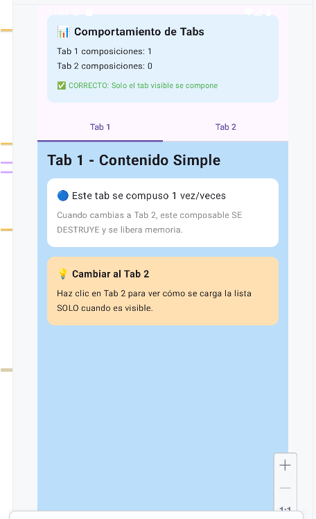

# 📱 Proyecto Android - Jetpack Compose

## 👥 Integrantes

- **Marron Carcausto Daniel Enrique**
- **Viza Cuti Rodrigo Estefano**

---

## 📋 Contenido

Este proyecto aborda dos problemas comunes en el desarrollo con Jetpack Compose:

1. [Problema 1: Modificar Elementos de una Lista](#-problema-1-modificar-elementos-de-una-lista)
2. [Problema 2: Listas Ocultas en Tabs](#-problema-2-listas-ocultas-en-tabs-voluntario)

---

## 🔧 Problema 1: Modificar Elementos de una Lista

### ❌ El Problema

Cuando intentamos modificar elementos de una lista en Jetpack Compose, la UI no se actualiza automáticamente. Esto ocurre porque Compose no puede "observar" los cambios en una lista normal.

```kotlin
// ❌ CÓDIGO CON ERROR - La UI NO se actualiza
@Composable
fun ListaProblema() {
    // Lista normal - NO observable
    var cursos = mutableListOf<Curso>()
    for (i in 1..100) {
        cursos.add(Curso(i, "Nombre $i", "Descripcion $i"))
    }
    
    Button(onClick = {
        // Modificamos la lista...
        cursos[0] = cursos[0].copy(nombre = "Nuevo Nombre")
        // ❌ PERO la UI NO se actualiza
    }) {
        Text("Modificar")
    }
    
    LazyColumn {
        items(cursos) { curso ->
            Text(curso.nombre)
        }
    }
}
```

**¿Por qué no funciona?**
- `mutableListOf()` es una lista normal de Kotlin
- Compose **no sabe** cuando modificamos sus elementos
- La UI permanece sin cambios aunque los datos sí cambiaron

---

### ✅ La Solución

Usamos `mutableStateListOf()` - una lista especial que **sí notifica** a Compose cuando cambia.

```kotlin
// ✅ CÓDIGO CORRECTO - La UI se actualiza automáticamente
@Composable
fun ListaSolucion() {
    // Lista observable con remember
    val cursos = remember {
        mutableStateListOf<Curso>().apply {
            for (i in 1..100) {
                add(Curso(i, "Nombre $i", "Descripcion $i"))
            }
        }
    }
    
    Button(onClick = {
        // Modificamos la lista...
        cursos[0] = cursos[0].copy(nombre = "Nuevo Nombre")
        // ✅ La UI se actualiza automáticamente
    }) {
        Text("Modificar")
    }
    
    LazyColumn {
        items(
            items = cursos,
            key = { it.id }  // ✅ Key importante para rendimiento
        ) { curso ->
            Text(curso.nombre)
        }
    }
}
```

### 🔑 Conceptos Clave

#### 1. `remember { }`
**¿Para qué sirve?** Preserva los datos entre recomposiciones.

```kotlin
// ❌ Sin remember: Los datos se pierden en cada recomposición
val lista = mutableStateListOf<Item>()

// ✅ Con remember: Los datos persisten
val lista = remember { mutableStateListOf<Item>() }
```

#### 2. `mutableStateListOf()`
**¿Para qué sirve?** Crea una lista que Compose puede observar.

```kotlin
// Cuando modificas:
cursos[5] = cursos[5].copy(nombre = "Nuevo")

// Compose automáticamente:
// 1. Detecta el cambio
// 2. Recompone la UI
// 3. Actualiza solo lo necesario
```

#### 3. `key` en LazyColumn
**¿Para qué sirve?** Mejora el rendimiento al identificar items únicos.

```kotlin
items(
    items = cursos,
    key = { it.id }  // Compose sabe qué item cambió exactamente
) { curso ->
    // ...
}
```

### 📊 Comparación Visual

| Aspecto | `mutableListOf()` ❌ | `mutableStateListOf()` ✅ |
|---------|---------------------|--------------------------|
| **Compose observa cambios** | ❌ No | ✅ Sí |
| **UI se actualiza** | ❌ No | ✅ Automáticamente |
| **Datos persisten** (sin remember) | ❌ Se pierden | ❌ Se pierden |
| **Datos persisten** (con remember) | ⚠️ Sí, pero sin actualizar UI | ✅ Sí, y actualiza UI |

---

## 📑 Problema 2: Listas Ocultas en Tabs (Voluntario)

### ❓ La Pregunta

**¿Qué pasa con una lista que está en un Tab que aún no es visible?**

¿Se carga en memoria? ¿Consume recursos? ¿Cuándo se crea?

---

### ✅ La Respuesta

**Solo se compone cuando es visible** - Compose es inteligente y eficiente.

```kotlin
@Composable
fun TabsEjemplo() {
    var tabSeleccionado by remember { mutableStateOf(0) }
    
    TabRow(selectedTabIndex = tabSeleccionado) {
        Tab(
            selected = tabSeleccionado == 0,
            onClick = { tabSeleccionado = 0 },
            text = { Text("Tab 1") }
        )
        Tab(
            selected = tabSeleccionado == 1,
            onClick = { tabSeleccionado = 1 },
            text = { Text("Tab 2") }
        )
    }
    
    // ✅ SOLUCIÓN CORRECTA: Solo compone el tab visible
    when (tabSeleccionado) {
        0 -> ContenidoTab1()  // Solo existe si tab = 0
        1 -> ContenidoTab2()  // Solo existe si tab = 1
    }
}
```

### 🎬 ¿Qué Sucede Internamente?

```
App inicia (Tab 1 seleccionado):
├─ ✅ ContenidoTab1() SE COMPONE
├─ ✅ Lista del Tab 1 se carga
└─ ❌ ContenidoTab2() NO EXISTE (no consume memoria)

Usuario cambia a Tab 2:
├─ 🗑️ ContenidoTab1() SE DESTRUYE (libera memoria)
├─ ✨ ContenidoTab2() SE CREA AHORA
└─ 📋 Lista del Tab 2 se carga

Usuario vuelve a Tab 1:
├─ 🗑️ ContenidoTab2() SE DESTRUYE
└─ ✅ ContenidoTab1() SE RECREA
```

### ⚠️ Error Común: Todos los Tabs Siempre Compuestos

```kotlin
// ❌ INCORRECTO: Ambos tabs siempre en memoria
Box {
    // Tab 1 siempre existe (solo oculto)
    Box(Modifier.alpha(if (tab == 0) 1f else 0f)) {
        ContenidoTab1()  // ⚠️ Siempre compuesto
    }
    
    // Tab 2 siempre existe (solo oculto)
    Box(Modifier.alpha(if (tab == 1) 1f else 0f)) {
        ContenidoTab2()  // ⚠️ Siempre compuesto
    }
}
```

**Problema:** Ambos tabs consumen memoria todo el tiempo, aunque solo uno sea visible.

### 📊 Comparación de Rendimiento

| Estrategia | Memoria Inicial | Tab Invisible | Rendimiento |
|------------|----------------|---------------|-------------|
| **when/if ✅** | 10 MB | 0 MB (no existe) | ⚡ Óptimo |
| **Siempre compuesto ❌** | 50 MB | 40 MB (existe pero oculto) | 🐌 Ineficiente |

### 💡 Estrategia: Carga Diferida

Para listas grandes, puedes mostrar un loading mientras cargas los datos:

```kotlin
@Composable
fun TabConLoading() {
    var datos by remember { mutableStateOf<List<Item>?>(null) }
    
    // Cargar datos cuando el tab es visible
    LaunchedEffect(Unit) {
        delay(500)  // Simular carga
        datos = cargarDatos()
    }
    
    if (datos == null) {
        CircularProgressIndicator()  // Mostrar loading
    } else {
        LazyColumn {
            items(datos) { item ->
                ItemCard(item)
            }
        }
    }
}
```

### 🎯 Conclusión: Comportamiento de Tabs

✅ **Lo que SÍ pasa:**
- Solo el tab visible se compone (con `when`/`if-else`)
- La lista se crea cuando el tab es visible
- Memoria se libera al cambiar de tab

❌ **Lo que NO pasa:**
- Tabs invisibles NO se componen
- Listas NO se cargan anticipadamente
- No hay consumo de memoria de tabs ocultos

**Recomendación:** Siempre usa `when` o `if-else` para cambiar entre tabs, nunca uses `alpha` o `visibility`.


## 📱 Capturas de Pantalla
**PROBLEMA 1**


**PROBLEMA 2**




## 📚 Recursos Adicionales

- [Documentación oficial de Compose](https://developer.android.com/jetpack/compose)
- [State en Compose](https://developer.android.com/jetpack/compose/state)
- [Lists en Compose](https://developer.android.com/jetpack/compose/lists)

---

## 📝 Licencia

Este proyecto es parte de un trabajo académico.

---

**Desarrollado  por Daniel Marron y Rodrigo Viza**